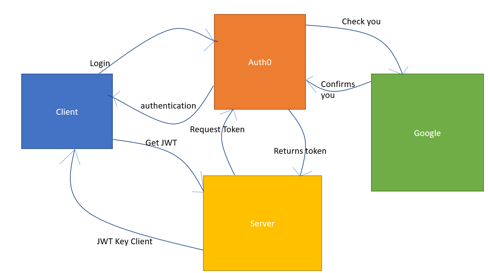

# Can Do Books - Front End

**Author**: Willem Jacobs
**Version**: 1.0.1 (increment the patch/fix version number if you make more commits past your first submission)
**Deployed Site**: NONE
**Backend Server** NONE

## Overview

A site that allows you to enter a city and get back the coordinates of the city along with a full name. A show map button is available to display a map of that city. Uses the LocationIQ API to get the data required. Gets the 5 day forecast for the city searched. Also gets movies from API that shows moves with the city name in the title. Uses a deployed node.js server created on Heroku.com.

## Getting Started

- Clone from repo. [Link to Repo](https://github.com/Willem-Jacobs/can-do-books)
- `npm install` or `npm i` to install dependencies.
- `.env` file needed see sample.env for values.

## Architecture

- Trello for Project Management
- React
- React Bootstrap & Bootstrap
- Axios
- auth0
- UML Lab-11 - 

## Change Log

08.14.2021 7:00pm (V1.0.0) - First release. Uses starter code. Uses auth0 to use Google to sign in. When authenticated, will show differnet items from the app.

## Credit and Collaborations

No collaborations from others on this project.

### Feature 1 Trello Card #1

**Name of feature:** Basic structure setup

**Estimate of time needed to complete:** 2 hour

**Start time:** 05:00pm

**Finish time:** 07:00pm

**Actual time needed to complete:** 2 hours.
